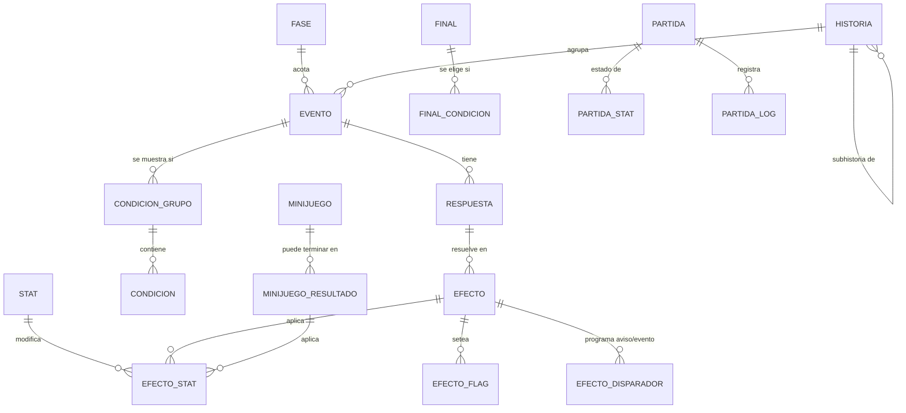

# Boceto de base de datos — Juego tipo REIGNS (carrera universitaria)

Versión 0.1 — borrador para discusión.

## Principio de diseño

La base se divide en **dos mundos**:

- **CONTENIDO (autoría)** — historias, eventos, respuestas, efectos, condiciones, minijuegos, finales. Es lo que se edita/carga y no cambia durante la partida.
- **RUNTIME (partida)** — el estado del jugador. Como el progreso **no se persiste** entre sesiones, esto puede vivir solo en memoria del navegador. Igual lo dejo modelado, porque conviene tenerlo definido aunque no se guarde en DB (y sirve si más adelante querés analytics).

---

## Diagrama de entidades



---

## 1. Configuración y catálogos

### `stat`
Los stats son datos, no columnas. Así podés agregar/sacar sin migrar.

| campo | tipo | notas |
|---|---|---|
| id | PK | |
| codigo | text unique | `animo`, `academico`, `social`, `plata`… |
| nombre | text | label visible |
| valor_inicial | int | |
| valor_min / valor_max | int | límites de la barra |
| clampea | bool | si `true` se recorta al llegar al tope; si `false` se guarda el excedente real (importa para el final) |
| visible | bool | permite stats ocultos (ej. "suerte" en v2) |
| orden | int | |

> Como "pasarse no te mata", no hay campo de game-over por stat. El único corte anticipado es el evento de abandono de carrera.

### `fase`
Las 16 rondas se parten en tramos.

| campo | tipo | notas |
|---|---|---|
| id | PK | |
| codigo | text | `ingresante`, `intermedio`, `avanzado` |
| ronda_desde / ronda_hasta | int | ej. 1–5, 6–11, 12–16 |
| ronda_minijuego | int | ronda "del medio" donde se inserta el minijuego |

### `configuracion`
Clave/valor global: `total_rondas = 16`, `minijuegos_por_partida = 3`, etc.

---

## 2. Textos y género

Todo texto que el jugador lee pasa por una **plantilla con marcadores**:

```
"Estás [cansado|cansada|cansade] y [el|la|le] docente te mira. {nombre}, decidí."
```

- `[m|f|nb]` → variante por género
- `{nombre}` → dato inicial del jugador

Para casos donde una frase entera cambia demasiado, tabla de override:

### `texto_variante`
| campo | notas |
|---|---|
| entidad_tipo | `evento`, `respuesta`, `efecto`, `final`… |
| entidad_id | |
| campo | `texto`, `titulo`… |
| genero | `m` / `f` / `nb` |
| contenido | texto completo que pisa la plantilla |

> Los **eventos son los mismos para los 3 géneros**; solo cambia la redacción. Por eso el género nunca entra como condición de aparición.

---

## 3. Historias

### `historia`
| campo | tipo | notas |
|---|---|---|
| id | PK | |
| codigo / nombre | text | |
| historia_padre_id | FK → historia | **subhistorias anidadas** |
| modo_secuencia | enum | `estricta` (el siguiente evento sale en la ronda inmediata) · `diferida` (pueden pasar otros eventos en el medio) · `libre` (orden indistinto) |
| gap_min / gap_max | int | solo si `diferida`: cuántos eventos ajenos pueden meterse entre eslabón y eslabón |
| peso | int | prioridad de la historia al competir con otras |
| exclusiva | bool | si `true`, mientras esté activa bloquea otras historias del mismo grupo |
| grupo_exclusion | text | nullable |

### `historia_evento`
| campo | notas |
|---|---|
| historia_id | FK |
| evento_id | FK |
| orden | posición en la cadena |
| obligatorio | si `true`, la historia no avanza sin él; si `false`, puede saltearse |

---

## 4. Eventos

### `evento`
| campo | tipo | notas |
|---|---|---|
| id | PK | |
| codigo | text unique | |
| tipo | enum | `normal` · `aviso` · `minijuego` · `abandono` |
| titulo | text | |
| texto | text | plantilla con marcadores |
| imagen | text | |
| peso | int | **probabilidad intrínseca** dentro de la bolsa (peso relativo, no porcentaje) |
| fase_id | FK nullable | atajo para "solo en esta fase" |
| ronda_min / ronda_max | int nullable | acotación fina por ronda |
| es_unico | bool | si ya salió, no vuelve |
| cooldown_rondas | int | si es repetible, cuántas rondas espera |
| minijuego_id | FK nullable | solo si `tipo = minijuego` |
| termina_partida | bool | el evento de abandono de carrera |

### Cómo se arma la bolsa (por ronda)

1. Filtrar eventos ya usados (`es_unico`) o en cooldown.
2. Evaluar **condiciones** de cada evento contra el estado actual (stats, fase, efectos previos, flags).
3. Si hay una historia activa con `modo_secuencia = estricta` y un siguiente eslabón elegible → **se fuerza ese evento**, sin sorteo.
4. Si hay historias `diferidas` cuyo gap ya venció → entran a la bolsa con peso aumentado.
5. Sorteo ponderado por `peso` entre todos los candidatos.

### `condicion_grupo` y `condicion`
Permite `(A AND B) OR (C)` sin volverse loco.

`condicion_grupo`: `id`, `evento_id`, `operador` (`AND` / `OR`), `orden`.

`condicion`:

| campo | notas |
|---|---|
| grupo_id | FK |
| tipo | ver abajo |
| negada | bool (`NOT`) |
| ref_id | id del stat / evento / efecto / historia según el tipo |
| operador | `=`, `!=`, `>`, `<`, `>=`, `<=`, `between` |
| valor_num / valor_num2 / valor_texto | |

Tipos de condición soportados:

- `stat` → *"animo < 30"*
- `fase` → *"solo en avanzado"*
- `ronda` → *"entre la ronda 8 y la 12"*
- `efecto_aplicado` → **el caso principal que pediste**: *"si en el evento X le tocó el efecto Y"*
- `respuesta_elegida` → por si alguna vez importa la decisión y no el resultado
- `evento_visto` → *"ya pasó por el evento Z"*
- `historia_estado` → *"la historia W está completa / activa / no iniciada"*
- `flag` → variable libre seteada por efectos (`beca_perdida = true`)

---

## 5. Respuestas

### `respuesta`
| campo | notas |
|---|---|
| id | PK |
| evento_id | FK |
| orden | 1 a 4 (mínimo 1, máximo 4) |
| texto | plantilla |
| gesto | `izq`, `der`, `arriba`, `abajo` — para el swipe estilo Reigns |
| preview_stats | bool: si se muestra el hint de qué stats toca |

Constraint: `1 <= count(respuesta) <= 4` por evento.

---

## 6. Efectos

### `efecto`
Resultado probabilístico de una respuesta.

| campo | notas |
|---|---|
| id | PK |
| respuesta_id | FK |
| peso | peso relativo dentro de esa respuesta (ej. 70 / 20 / 10) |
| texto_resultado | lo que se muestra tras elegir |
| es_default | fallback si ninguna condición matchea |

### `efecto_stat`
| campo | notas |
|---|---|
| efecto_id | FK |
| stat_id | FK |
| operacion | `sumar` / `fijar` / `multiplicar` |
| valor | puede ser negativo |
| valor_min / valor_max | opcional: rango aleatorio en vez de valor fijo |

### `efecto_flag`
`efecto_id`, `clave`, `valor` — marca estado narrativo arbitrario.

### `efecto_disparador` → **AVISOS**
Un aviso es un evento diferido que comenta el resultado de una decisión pasada.

| campo | notas |
|---|---|
| efecto_id | FK — qué efecto lo dispara |
| evento_destino_id | FK → evento (normalmente `tipo = aviso`) |
| demora_min / demora_max | en rondas |
| prioridad | los avisos vencidos se meten con peso alto o se fuerzan |
| forzado | bool: si `true` se muestra sí o sí al vencer la demora |

> Ventaja: el aviso reutiliza toda la maquinaria de evento (puede tener respuestas y efectos propios, o ninguna y ser solo texto informativo).

---

## 7. Minijuegos

### `minijuego`
| campo | notas |
|---|---|
| id | PK (son 7) |
| codigo / nombre / descripcion | |
| config | JSON con parámetros (dificultad, duración, etc.) |
| fases_permitidas | array/tabla puente: en qué fases puede caer |
| peso | para el sorteo de los 3 de la partida |

### `minijuego_resultado`
| campo | notas |
|---|---|
| minijuego_id | FK |
| codigo | `exito`, `parcial`, `fallo` — o rangos de puntaje |
| puntaje_min / puntaje_max | |
| texto | |

Los deltas de stats cuelgan de `efecto_stat` reutilizando el mismo mecanismo (o una tabla espejo `minijuego_resultado_stat`).

**Selección:** al iniciar la partida se sortean 3 de los 7 (uno por fase, respetando `fases_permitidas`) y se guardan en el estado de la partida.

---

## 8. Finales

### `final`
| campo | notas |
|---|---|
| id | PK |
| codigo / titulo / texto / imagen | |
| prioridad | se evalúan de mayor a menor; gana el primero que cumple |
| es_default | el final genérico si no matchea ninguno |
| requiere_abandono | bool: final exclusivo del evento de abandono |

### `final_condicion`
Misma estructura que `condicion` (stat/flag/evento_visto/historia_estado), agrupadas con AND/OR. Esto cubre "de tener tal puntaje en **uno o varios** stats".

---

## 9. Runtime (partida)

Aunque no se persista, el estado en memoria necesita esta forma:

```
partida {
  jugador: { nombre, genero, <dato extra> },
  ronda_actual: 1..16,
  fase_actual,
  stats: { [stat_codigo]: valor },
  flags: { [clave]: valor },
  eventos_vistos: [ { evento_id, ronda, respuesta_id, efecto_id } ],
  historias: { [historia_id]: { estado, indice_actual, ultima_ronda } },
  avisos_pendientes: [ { evento_id, ronda_objetivo, forzado } ],
  minijuegos_asignados: { ingresante: id, intermedio: id, avanzado: id },
  terminada: bool,
  final_id: null
}
```

Tablas opcionales si querés analytics: `partida`, `partida_stat`, `partida_log` (una fila por ronda con evento, respuesta y efecto elegidos).

---

## 10. Reglas duras a validar en el editor

- Un evento tiene entre 1 y 4 respuestas.
- Una respuesta tiene ≥1 efecto, y los pesos suman > 0.
- Exactamente **un** evento con `tipo = abandono` (o al menos uno marcado `termina_partida`).
- Toda historia con `modo_secuencia = estricta` debe caber en las rondas disponibles.
- Debe existir al menos un `final` con `es_default = true`.
- No debe haber ciclos en `historia.historia_padre_id`.
